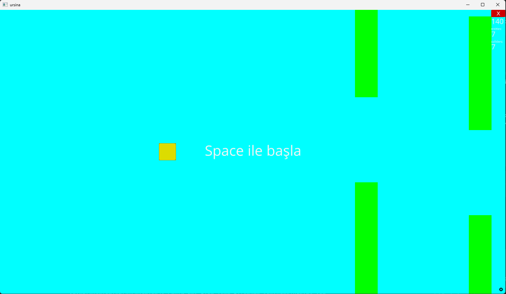

# Flappy Bird

Bu proje, Python ve `Ursina` kullanılarak geliştirilmiş sade bir Flappy Bird klonudur.

## Ekran Goruntusu



## Gereksinimler

- Python 3
- `ursina`

## Kurulum

```bash
pip install ursina
```

## Çalıştırma

```bash
python flappybird.py
```

## Oynanış

- Oyunu başlatmak için `Space` tuşuna basın.
- Kuşu havada tutmak için `Space` tuşuna basmaya devam edin.
- Borulara veya ekran sınırlarına çarparsanız oyun kapanır.

## Dosyalar

- `flappybird.py`: Oyunun ana kaynak kodu
